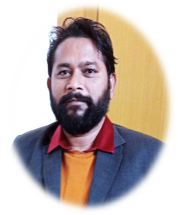

# Dr. MANISH KUMAR

> Assistant Professor • Department of Electrical Engineering • School of Engineering and Technology • Central University of Haryana.

 

<table align="center">
  <tr>
    <td align="center" width="280">
      
    </td>
    <td width="550" valign="top">
      <h2>👤 Profile Overview</h2>
      

      
<b>🗣️ Name:</b> Dr. MANISH KUMAR

      
<b>💼 Position:</b> Assistant Professor

      
<b>🏢 Department:</b> Electrical Engineering

      
<b>🏫 Under:</b> School of Engineering and Technology

      
<b>🏛️ University:</b> Central University of Haryana

      
<b>📧 Email:</b> khanagwal.manish@gmail.com

    </td>
  </tr>
</table>

---

## 📢 Latest Updates

- ✨ Manish Kumar and Sangeeta, et al, “Renewable Energy Powered Poles to detect noise pollution”, Design Granted on 03/03/2025.
- ✨ Muralidhar Nayak Bhukya and Manish Kumar, et al, “Facial Emotions based online exam cheat detection”, published 08/03/2024.

---

## 🎓 Academic Education

| Degree | Specialization | Institute / University |
| :--- | :--- | :--- |
| **Ph.D** | Electrical Engineering | NIT Kurukshetra |
| **M.Tech** | - Electrical Engineering (Power System) | NIT Kurukshetra |
| **B.E** | - Instrumentation Engineering | SLIET Longowal, Punjab |
| **Diploma** | Electrical Engineering | Govt. Polytechnic Sirsa |

---

## 💡 Area of Specialization

- ✅ Renewable Energy Sources
- ✅ Electrical Vehicle
- ✅ Optimization Techniques
- ✅ Deregulated Electricity Markets
- ✅ Congestion Management of Transmission and Distribution System
- ✅ Nodal price Management of Transmission and Distribution System

---

## 💼 Experience & Administration

### Academic Experience

- 8+ Assistant Professor in Electrical Engg. Deptt. SOE&T, CUH
- Five year four month research as a Senior Research Fellow in NIT Kurukshetra.
- Assistant Professor in Doon Vally Engg. College, Karnal. 2011.
- One year teaching as an Lecture in CDLM Engg.College Paniwala mota Sirsa.

### Administrative Roles

- OSD Vice- Chancellor ( Infra Maintenance) in CUH
- Executive Engineer (Electrical) in CUH
- M.tech Course Co-Ordinator
- Member of School Board (SOET)
- Member of BOS & DRC
- Coordinator of M.tech & B.tech Admission Committee
- Member of Ph.D Admission Committee
- Member of Proctorial Duty in 10th convocation 2024
- Lab In-charge of Machine and M.Tech lab
- Nodal Officer (Nasha Mukt Bhart Abhyan)
- Member of Security, Parking and Discipline Committee

---

## 📅 Events & Workshops Organized

- Organizing Secretary of International Conference on Smart and Sustainable Technologies in Energy and Power Sector (SSTEPS)-2022
- Organizing Publicity Chairs International Conference on Future Power Network and Smart Energy Systems: Issues and Challenges (FPNSES-2023)
- 5day workshop on MATLAB (8- 12th March,2019)
- 5 Day workshop on Arduino software (26-30th April 2019)
- 5Day workshop on Application of Optimization Techniques in power system using GAMS & MATLAB software.
- Webinar Series on “Awareness on Alcoholic Addiction and Drug Abuse among Youths”
- V.C Trophy organized on 3rd May, 2019 as a Coordinator
- Induction Program of B.Tech 1st year students 2019
- Nasha Mukth Bhart Abhiyan organized with Ministry of Social Justice and Empowerment , Govt. of India, 04/08/2022
- Constitution Day, 21 November 2022.
- Motivational lecture for UPSC Aspirants, 4May 2023

---

## 📊 Impact & Contributions

### 📚 Publications & Patents

- Journals: 27
- Book Chapters: 2
- Conferences: 16
- Total Patents: 06
- Granted Patents: 2
- Published Patents: 4

### 👨‍🎓 Research Supervision

- Ph D = 2
- M. Tech = 04

### 🏗️ Labs Established

- Control system Engineering Lab
- Analog Electronic Lab
- Microprocessor & interfacing Lab
- Workshop Lab (Machine, Carpentry, Fitting, Welding, Foundry)
- Energy Lab-1

---

_Designed & Developed with ❤️ by [vikasingh0897](https://github.com/vikasingh0897)_

